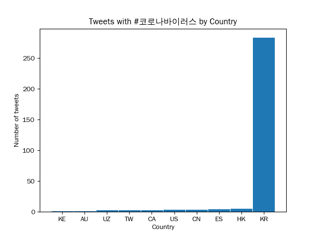
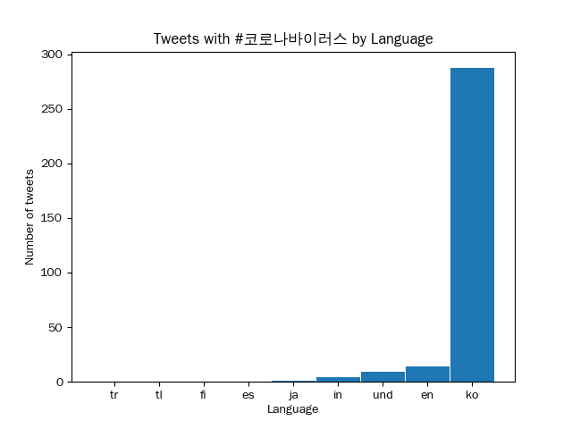

# Coronavirus twitter analysis

## Overview

This project analyzes approximately 1.1 billion geotagged tweets from 2020 to monitor the spread of coronavirus on social media. Using Python and a MapReduce workflow, the program enables users to:

-  Extract the daily number of tweets associated with selected hashtags in 2020
- Reduce daily totals to compute the total number of tweets associated with selected hashtags for the whole year in 2020
- Group tweets by country or language
- Visualize these results into bar and line plots

By visualizing hashtag frequency over time and across regions, this project allows users to critically examine how COVID-19 discourse evolved geographically and linguistically throughout 2020.

## Project Architecture

Because the dataset contains over 1 billion tweets, this project uses a MapReduce-style pipeline to efficiently process large-scale data:

1. Map Phase – Extract relevant hashtag data and group by country/language
2. Reduce Phase – Aggregate hashtag counts across files or time periods
3. Visualization Phase – Generate plots for interpretation

## Directory Structure
`./src` contains all the Python code for this project. It is broken up into several sections:
- `./src/map.py`,
    - Creates a JSON object containing number of tweets associated with specified hashtags, grouped by language and country
    - Acts as the “Map” stage in the MapReduce workflow 
- `./src/reduce.py`
    - Aggregates hashtag counts from multiple intermediate files into a single combined JSON object
    - Computes yearly totals from daily or chunked results
- `./src/visualize.py`,
   - Produces a bar plot of the top 10 countries or languages using a specified hashtag
   - Outputs a `.png` file for comparative geographic or linguistic analysis
- `./src/alternate_reduce.py`
    - Partially reduces and aggregates hashtag counts from intermediate files
    - Generates a line plot showing hashtag usage over time (days in 2020) and outputs a `.png` file

Further, in the main folder we have helper files:
- `hashtags`
    - Plain text file containing the list of tracked hashtags 
- `run_maps.sh`
    - Shell script that executes our `./src/map.py` code  across the full 2020 dataset.
    - Automates batch processing of large tweet files.

## Example Plots

Here are a few example plots you could get by running this program:

Using `visualize.py`, you can obtain barplots of with the top 10 countries by number of tweets for the given hashtag:

For `#coronavirus`:

For `#코로나바이러스`:

We can also group by language:

For `#coronavirus`:

For `#코로나바이러스`:

Using `alternate_reduce.py`, we can obtain lineplots which demonstrates how usage of hashtags compare between each other and over 2020:

Graph displaying #coronavirus in different languages over 2020:

 
We can also analyze differences in language and how people referred to the coronavirus online and how this changed over the year:

